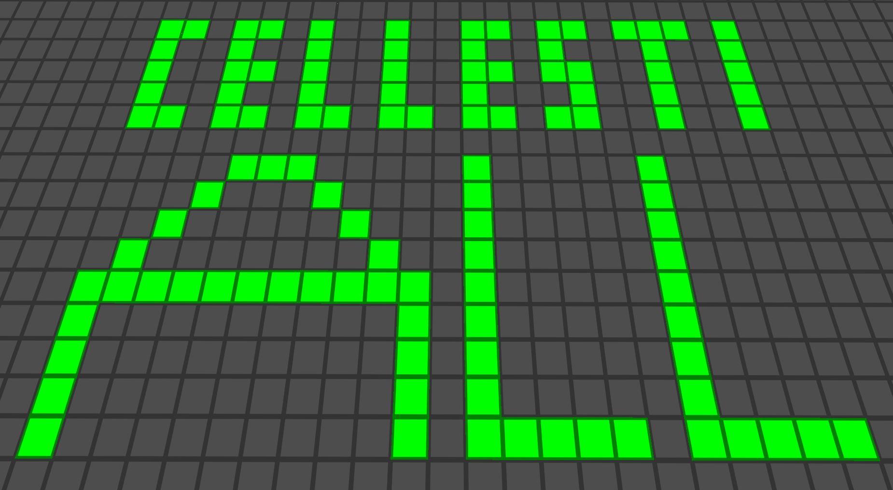

# World of Life (`cellestiall`)

Makes your entire game a cellular one.

## About

Cellestiall (**cell**-esti-**all**) extends Cellestial to the entire world. Accordingly depends on [`cellestial`](https://github.com/appgurueu/cellestial). Media & code by Lars Mueller aka LMD or appguru(eu). Code licensed under the MIT license, media licensed as CC0. 

Part of the Cellestial Series: [`cellestial`](https://github.com/appgurueu/cellestial), [`cellestiall`](https://github.com/appgurueu/cellestiall) and [`cellestial_game`](https://github.com/appgurueu/cellestial_game)

## Symbolic Representation

### Links

* [GitHub](https://github.com/appgurueu/cellestiall)
* [Discord](https://discordapp.com/invite/ysP74by)
* [ContentDB](https://content.minetest.net/packages/LMD/cellestiall)
* [Minetest Forum](): Will create a topic